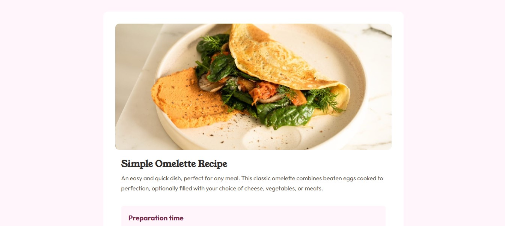

# Frontend Mentor - Recipe page solution

This is a solution to the [Recipe page challenge on Frontend Mentor](https://www.frontendmentor.io/challenges/recipe-page-KiTsR8QQKm). Frontend Mentor challenges help you improve your coding skills by building realistic projects. 

## Table of contents

- [Overview](#overview)
  - [The challenge](#the-challenge)
  - [Screenshot](#screenshot)
  - [Links](#links)
- [My process](#my-process)
  - [Built with](#built-with)
  - [What I learned](#what-i-learned)
  - [Useful resources](#useful-resources)
- [Author](#author)

## Overview

### Screenshot




### Links

- Solution URL: [Solution URL](https://your-solution-url.com)
- Live Site URL: [Live site](https://lolontor.github.io/recipe-page-main/)

## My process

### Built with

- Semantic HTML5 markup
- CSS custom properties
- Flexbox
- Mobile-first workflow
- CSS tables
- CSS lists

### What I learned

This challenge has been insightful. I was able learn some cool css properties like the list marker selector. I also learnt how to use the section semantic html element. I got a better understanding of aria-lable attribute.

```css
li::marker{
    color: var(--Brown800);
    font-weight: bold;
}
```

### Useful resources

I got most of my resourses from 
- W3Schools - [view site](https://www.w3schools.com/)
- MDN - [view site](https://developer.mozilla.org/en-US)


## Author

- Frontend Mentor - [@Lolontor](https://www.frontendmentor.io/profile/Lolontor)
- freeCodeCamp - [@elolontor](https://www.freecodecamp.org/elolontor)
- linkedin - [@Mawulolo Kwame](https://www.linkedin.com/in/mawulolo-kwame-b54a171a1)
- github - [@Lolontor](https://github.com/Lolontor)


